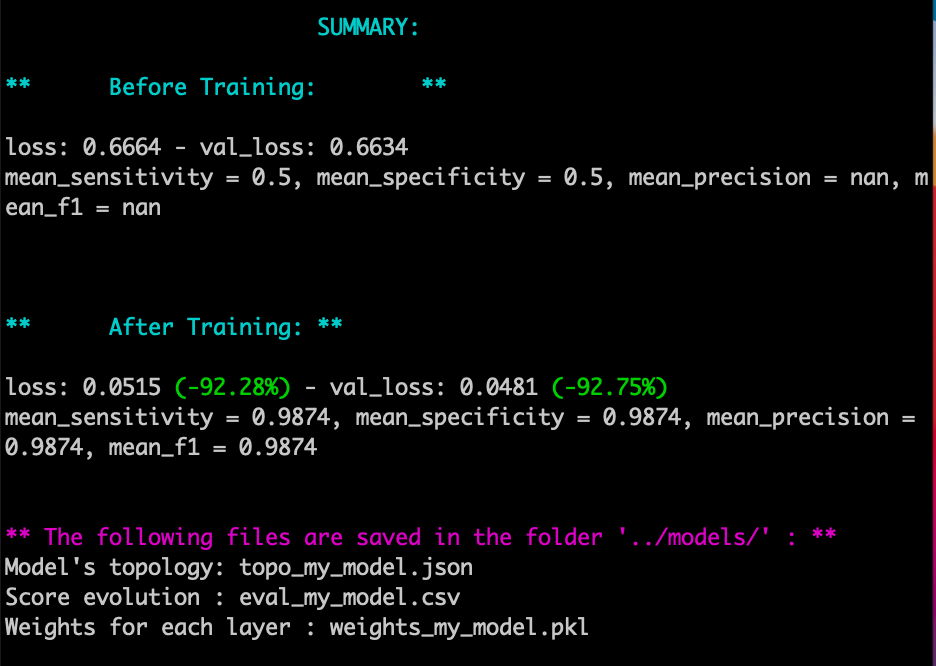

# Multilayer Perceptron

The goal of this project is to create a multilayer perceptron neural network from scratch. Which means implementing the mathematical formulas for feedforward, backpropagation & gradient descent
(cf mlp_subject.pdf)

## Prerequisit:
If you do not have python3, run:</br>
```apt-get install python3```</br>
To create a virtual environment, run:</br>
```python3 -m venv [your_env_name]```</br>
Then: ```source [your_env_name]/bin/activate```</br>
Finally:</br>
```cd src```</br>
```pip install --upgrade pip```</br>
```pip install -r requirements.txt```</br>

## I. Training
Run ```python3 train.py``` to train the model on the dataset that is given by the subject and stored in ```../datasets/data.csv```. </br>Use ```-h``` to display the usage and the options

## II. Comparing
Run ```python3 compare.py``` to compare different models (differents optimizers, activation functions, loss functions)

### Training Output example:


## III. Predicting
Run ```python3 predict.py``` to make one prediction on a part of the dataset and calculate our loss.
</br>Use ```-h``` to display the usage and the options